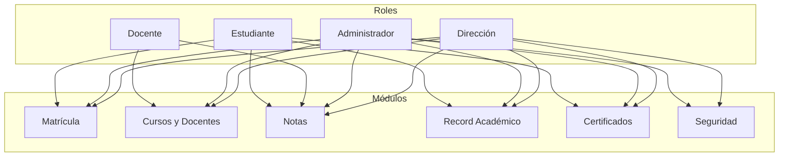
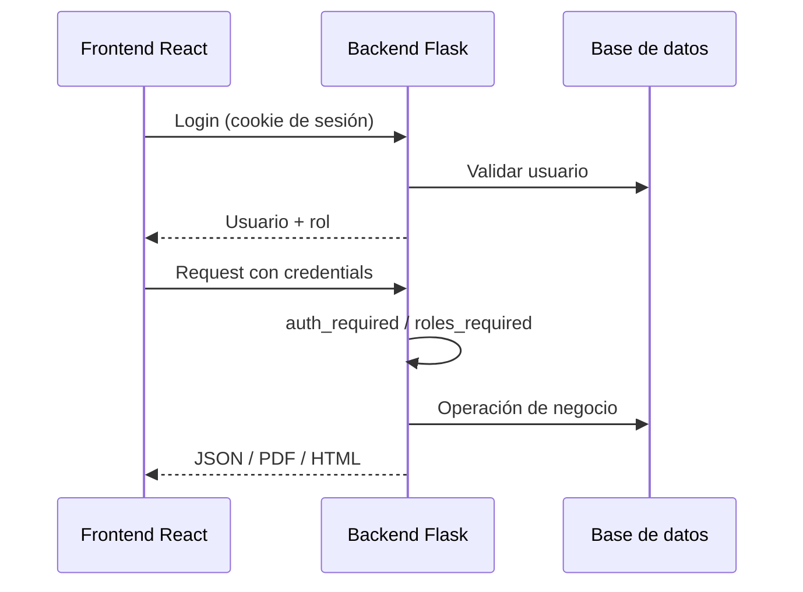
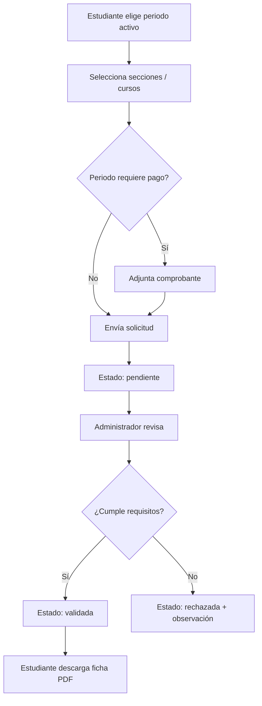
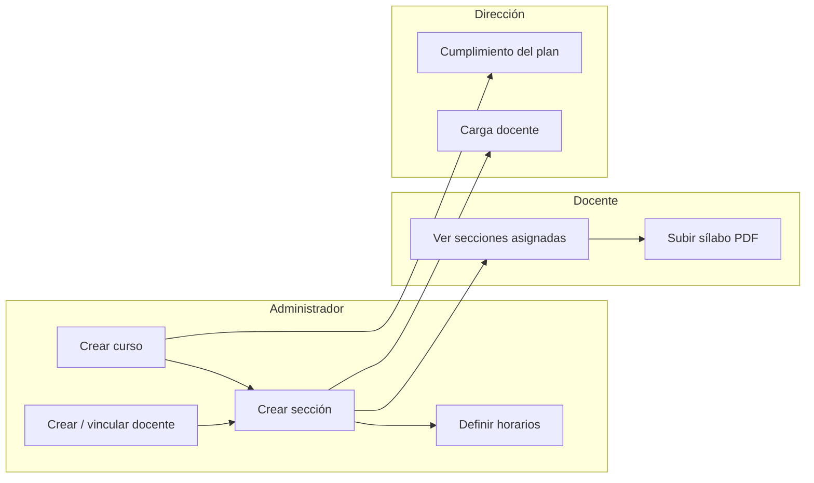
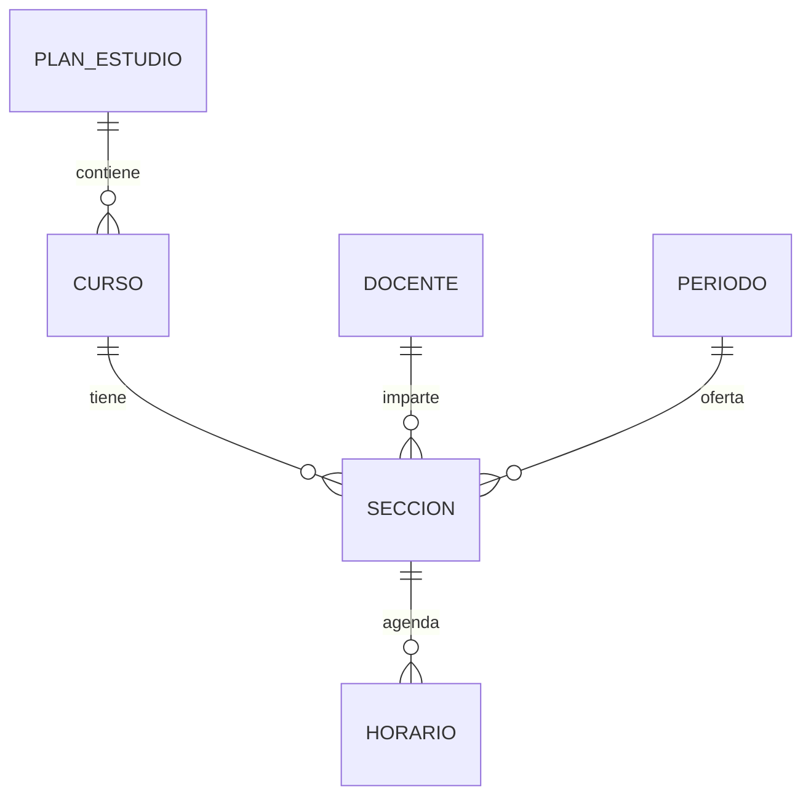
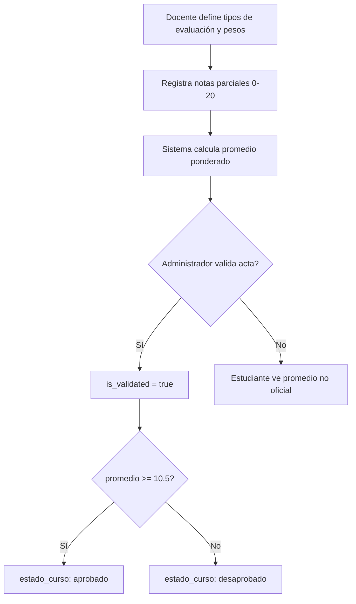
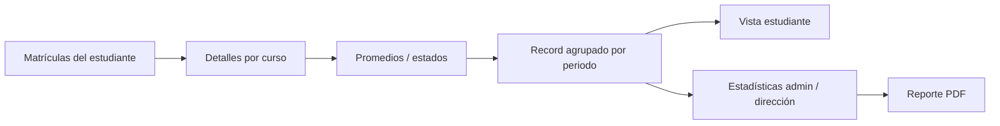
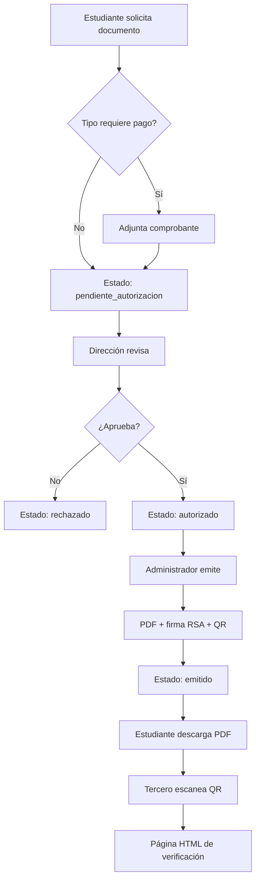
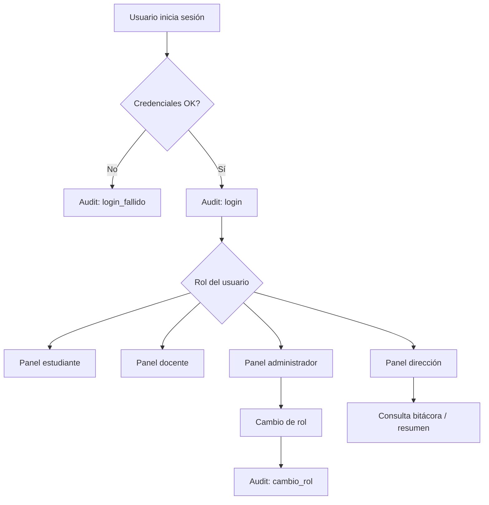

# Documentación de módulos — Sistema académico

Documentación técnica de los módulos implementados: diagramas de flujo, funciones principales y código relevante del repositorio.

| Elemento | Detalle |
|----------|---------|
| Backend | Flask 3 + SQLAlchemy + flask-openapi3 + ReportLab + qrcode + cryptography |
| Frontend | React 19 + Vite + React Router 7 + Axios + Tailwind |
| Prefijo API | `/api` |
| Roles | `estudiante` · `docente` · `administrador` · `direccion` |

---

## Índice

1. [Visión general](#1-visión-general)
2. [Módulo de Matrícula](#2-módulo-de-matrícula)
3. [Módulo de Cursos y Docentes](#3-módulo-de-cursos-y-docentes)
4. [Módulo de Notas](#4-módulo-de-notas)
5. [Módulo de Record Académico](#5-módulo-de-record-académico)
6. [Módulo de Certificados y Documentos](#6-módulo-de-certificados-y-documentos)
7. [Módulo de Administración y Seguridad](#7-módulo-de-administración-y-seguridad)
8. [Mapa de permisos](#8-mapa-de-permisos)

---

## 1. Visión general



### Arquitectura de acceso



---

## 2. Módulo de Matrícula

### Objetivo

Gestionar la solicitud de matrícula por periodo, la revisión de requisitos/pago y la emisión de la ficha oficial.

### Roles y vistas

| Rol | Ruta frontend | Capacidad |
|-----|---------------|-----------|
| Estudiante | `/estudiante/matricula` | Solicitar, ver estado, comprobante, ficha PDF |
| Administrador | `/administrador/matricula` | Validar/rechazar, configurar pago |
| Dirección | `/direccion/matricula` | Estadísticas y supervisión |

### Diagrama de flujo



### Estados

```
pendiente → validada | rechazada
```

Detalle por curso: `estado_curso = matriculado` (luego puede pasar a `aprobado` / `desaprobado` al validar notas).

### Endpoints principales

| Método | Endpoint | Rol |
|--------|----------|-----|
| `POST` | `/api/matriculas/` | estudiante |
| `GET` | `/api/matriculas/mias` | estudiante |
| `GET` | `/api/matriculas/?estado=` | admin / dirección |
| `PUT` | `/api/matriculas/<id>/validar` | administrador |
| `GET` | `/api/matriculas/estadisticas` | dirección |
| `GET` | `/api/matriculas/<id>/comprobante` | roles autorizados |
| `GET` | `/api/matriculas/<id>/ficha` | matrícula validada |

### Funciones / servicios principales

| Ubicación | Función | Descripción |
|-----------|---------|-------------|
| `MatriculaService` | `crear_matricula` | Crea solicitud `pendiente`, detalles y comprobante |
| `MatriculaService` | `validar_matricula` | Cambia a `validada` o `rechazada` |
| `MatriculaService` | `generar_ficha_pdf` | PDF oficial con ReportLab |
| `MatriculaService` | `estadisticas` | Totales por estado |
| `CursoService` | `listar_disponibles_para_matricula` | Cursos con prerrequisitos |

### Código resaltante

**Creación en estado pendiente**

```111:126:backend/app/services/matricula_service.py
        matricula = Matricula(
            periodo_academico_id=periodo.id,
            estudiante_id=estudiante_id,
            estado="pendiente",
            comprobante_url=comprobante_url,
        )
        db.session.add(matricula)
        db.session.flush()

        for seccion in secciones:
            detalle = DetalleMatricula(
                matricula_id=matricula.id,
                seccion_id=seccion.id,
                estado_curso="matriculado",
            )
            db.session.add(detalle)
```

**Ficha PDF solo si está validada**

```193:211:backend/app/services/matricula_service.py
        if matricula.estado != "validada":
            raise ValueError(
                "Solo se puede descargar la ficha de una matrícula validada"
            )
        # ...
        c.setFont("Helvetica-Bold", 16)
        c.drawCentredString(width / 2, y, "FICHA DE MATRÍCULA")
        y -= 0.8 * cm
        c.setFont("Helvetica", 10)
        c.drawCentredString(width / 2, y, "Universidad Nacional del Centro del Perú")
```

---

## 3. Módulo de Cursos y Docentes

### Objetivo

Administrar la oferta académica (cursos, secciones, horarios), la asignación docente y el seguimiento del plan de estudios.

### Roles y vistas

| Rol | Rutas frontend | Capacidad |
|-----|----------------|-----------|
| Administrador | `/administrador/cursos`, `/docentes`, `/secciones` | CRUD cursos, docentes, secciones y horarios |
| Docente | `/docente/cursos`, `/docente/secciones` | Ver asignaciones, subir sílabo |
| Dirección | `/direccion/carga-docente`, `/cumplimiento-plan` | Indicadores de carga y cobertura del plan |

### Diagrama de flujo



### Modelo conceptual



### Endpoints principales

| Prefijo | Operaciones clave |
|---------|-------------------|
| `/api/cursos` | CRUD, `/disponibles`, `/cumplimiento-plan` |
| `/api/docentes` | CRUD perfil, `/me`, `/<id>/secciones`, `/carga-docente` |
| `/api/secciones` | CRUD, `PUT/GET /<id>/silabo` |
| `/api/horarios` | CRUD (administrador) |
| `/api/periodos-academicos` | Gestión de periodos y `requiere_pago` |

### Funciones / servicios principales

| Servicio | Funciones |
|----------|-----------|
| `CursoService` | `crear_curso`, `listar_disponibles_para_matricula`, `cumplimiento_plan_estudios` |
| `DocenteService` | `crear_docente`, `secciones_de_docente`, `carga_docente` |
| `SeccionService` | `crear_seccion`, `subir_silabo`, control de aforo |
| `HorarioService` | CRUD de horarios por sección |
| `FileService` | `save_silabo`, validación de PDF |

### Código resaltante

**Protección por roles (aplicada a todo el sistema)**

```28:41:backend/app/middleware/auth.py
def roles_required(*allowed_roles):
    """Permite el acceso solo a usuarios con alguno de los roles indicados."""

    def decorator(view):
        @wraps(view)
        @auth_required
        def wrapped(*args, **kwargs):
            user = g.current_user
            if user.rol not in allowed_roles:
                return {"error": "No tienes permisos para acceder a este recurso"}, 403

            return view(*args, **kwargs)

        return wrapped

    return decorator
```

---

## 4. Módulo de Notas

### Objetivo

Registrar evaluaciones parciales, calcular promedios ponderados y oficializar actas.

### Roles y vistas

| Rol | Ruta | Capacidad |
|-----|------|-----------|
| Docente | `/docente/notas` | Registrar notas y tipos de evaluación |
| Estudiante | `/estudiante/notas` | Consultar hoja de notas por ciclo |
| Administrador | `/administrador/notas` | Validar actas (promedios oficiales) |
| Dirección | `/direccion/notas` | Indicadores académicos |

### Diagrama de flujo



### Endpoints principales

| Método | Endpoint | Rol |
|--------|----------|-----|
| `POST/PUT` | `/api/evaluaciones` | docente / admin |
| `POST` | `/api/evaluaciones/tipo-evaluaciones` | docente / admin |
| `GET` | `/api/evaluaciones/seccion/<id>/notas` | matriz de notas |
| `POST` | `/api/evaluaciones/seccion/<id>/validar-promedio` | administrador |
| `POST` | `/api/evaluaciones/seccion/<id>/validar-todos` | administrador |
| `GET` | `/api/evaluaciones/estudiante/mis-notas` | estudiante |
| `GET` | `/api/evaluaciones/direccion/estadisticas` | dirección |

### Funciones / servicios principales

| Función | Descripción |
|---------|-------------|
| `EvaluacionService.crear_evaluacion` | Alta de nota parcial |
| `EvaluacionService._calcular_promedio_por_detalle` | Promedio ponderado |
| `EvaluacionService.validar_promedio` | Oficializa un estudiante |
| `EvaluacionService.validar_todos_promedio` | Oficializa toda la sección |
| `TipoEvaluacionService` | Gestiona tipos y pesos |

### Código resaltante

**Validación de promedio y umbral de aprobación**

```171:181:backend/app/services/evaluacion_service.py
    def validar_promedio(detalle_matricula_id):
        detalle = DetalleMatricula.query.get(detalle_matricula_id)
        if not detalle:
            raise ValueError("El detalle de matrícula no existe")

        promedio = EvaluacionService._calcular_promedio_por_detalle(detalle_matricula_id)
        detalle.promedio_final = promedio
        detalle.is_validated = True
        detalle.estado_curso = "aprobado" if promedio is not None and promedio >= 10.5 else "desaprobado"
        db.session.commit()
        return float(promedio) if promedio else None
```

---

## 5. Módulo de Record Académico

### Objetivo

Exponer el historial académico del estudiante y reportes consolidados por periodo.

### Roles y vistas

| Rol | Ruta | Capacidad |
|-----|------|-----------|
| Estudiante | `/estudiante/record-academico` | Historial completo |
| Administrador | `/administrador/record-academico` | Análisis + PDF |
| Dirección | `/direccion/record-academico` | Desempeño por periodo |

### Diagrama de flujo



### Endpoints principales

| Método | Endpoint | Rol |
|--------|----------|-----|
| `GET` | `/api/evaluaciones/estudiante/record-academico` | estudiante |
| `GET` | `/api/evaluaciones/direccion/record-academico` | admin / dirección |
| `GET` | `/api/evaluaciones/direccion/record-academico/reporte` | administrador (PDF) |

### Funciones / servicios principales

| Función | Descripción |
|---------|-------------|
| `EvaluacionService.record_academico` | Historial personal por periodos |
| `EvaluacionService.record_academico_stats` | Agregados por curso/sección |
| `EvaluacionService.generar_reporte_record_academico_pdf` | Exportación PDF |

---

## 6. Módulo de Certificados y Documentos

### Objetivo

Solicitar, autorizar y emitir documentos oficiales con ticket, firma digital RSA y código QR verificable.

### Roles y vistas

| Rol | Ruta | Capacidad |
|-----|------|-----------|
| Estudiante | `/estudiante/documentos` | Solicitar, seguir ticket, descargar PDF |
| Dirección | `/direccion/documentos` | Autorizar / rechazar, configurar tipos |
| Administrador | `/administrador/documentos` | Emitir PDF con firma y QR |

### Diagrama de flujo



### Estados

```
pendiente_autorizacion → autorizado | rechazado
autorizado → emitido
```

### Endpoints principales

| Método | Endpoint | Rol |
|--------|----------|-----|
| `POST` | `/api/documentos/solicitudes` | estudiante |
| `GET` | `/api/documentos/solicitudes` | según rol |
| `POST` | `/api/documentos/solicitudes/<id>/autorizar` | dirección |
| `POST` | `/api/documentos/solicitudes/<id>/emitir` | administrador |
| `GET` | `/api/documentos/solicitudes/<id>/archivo` | descarga PDF |
| `GET` | `/api/documentos/verificar/<qr_hash>` | **público** (HTML/JSON) |

### Funciones / servicios principales

| Servicio | Función | Descripción |
|----------|---------|-------------|
| `DocumentService` | `generate_ticket_code` | Código `REQ-YYYY-####` |
| `DocumentService` | `generate_qr_hash` | Token hex de verificación |
| `DocumentService` | `generate_document` | Arma PDF + pie de seguridad |
| `DocumentService` | `build_verification_url` | URL del QR |
| `SignatureService` | `sign_document` / `verify_signature` | RSA-PSS-SHA256 |
| `AuditService` | `log` | Traza autorización/emisión |

### Código resaltante

**URL y generación del QR**

```46:87:backend/app/services/document_service.py
    def build_verification_url(qr_hash: str) -> str:
        return public_api_url(f"/api/documentos/verificar/{qr_hash}")

    @staticmethod
    def generate_qr_hash() -> str:
        return secrets.token_hex(16)
    # ...
    def _build_qr_image(verification_url: str) -> io.BytesIO:
        qr = qrcode.QRCode(box_size=8, border=2)
        qr.add_data(verification_url)
        qr.make(fit=True)
        image = qr.make_image(fill_color="black", back_color="white")
```

**Firma digital RSA-PSS**

```77:93:backend/app/services/signature_service.py
    def sign_document(cls, solicitud, qr_hash: str) -> dict:
        private_key = cls._load_private_key()
        payload = cls.build_payload(solicitud, qr_hash)
        signature = private_key.sign(
            payload,
            padding.PSS(
                mgf=padding.MGF1(hashes.SHA256()),
                salt_length=padding.PSS.MAX_LENGTH,
            ),
            hashes.SHA256(),
        )
        return {
            "firma_digital": signature.hex(),
            "firma_algoritmo": "RSA-PSS-SHA256",
            "firma_huella_cert": cls.fingerprint(),
            "contenido_hash": cls.content_hash(solicitud, qr_hash),
        }
```

**Emisión: PDF + persistencia de firma y QR**

```279:308:backend/app/routes/documents.py
@roles_required("administrador")
def issue_document(path: SolicitudDocumentoPath):
    """Emitir certificados con PDF, firma digital y codigo QR."""
    # ...
    archivo_url, qr_hash, firma_info = DocumentService.generate_document(solicitud)
    solicitud.estado = "emitido"
    solicitud.archivo_url = archivo_url
    solicitud.qr_hash = qr_hash
    solicitud.firma_digital = firma_info["firma_digital"]
    # ...
    AuditService.log(
        accion="emitir_documento",
        recurso=solicitud.codigo_ticket or f"solicitud:{solicitud.id}",
        detalle=f"Documento emitido con firma digital: {solicitud.tipo_documento}",
        user=g.current_user,
    )
```

**Construcción del PDF emitido**

```452:507:backend/app/services/document_service.py
    def generate_document(cls, solicitud) -> tuple[str, str, dict]:
        qr_hash = cls.generate_qr_hash()
        firma_info = SignatureService.sign_document(solicitud, qr_hash)
        # ...
        content = cls._build_common_header(solicitud, title_style, subtitle_style, body_style)
        content.extend(cls._build_type_specific_body(solicitud, body_style))
        content.extend(cls._build_security_footer(qr_hash, firma_info, body_style, mono_style, subtitle_style))
        doc.build(content)
        return f"/api/documentos/solicitudes/{solicitud.id}/archivo", qr_hash, firma_info
```

---

## 7. Módulo de Administración y Seguridad

### Objetivo

Controlar perfiles de acceso (RBAC) y auditar acciones críticas del sistema.

### Roles y vistas

| Rol | Ruta | Capacidad |
|-----|------|-----------|
| Administrador | `/administrador/seguridad` | Cambiar roles de usuarios |
| Dirección | `/direccion/auditorias` | Resumen estratégico y bitácora |
| Todos | Login | Acceso según rol asignado |

### Diagrama de flujo



### Acciones auditadas

| Acción | Origen típico |
|--------|---------------|
| `login` / `login_fallido` / `logout` | Auth |
| `cambio_rol` | Administrador |
| `autorizar_documento` / `rechazar_documento` | Dirección |
| `emitir_documento` | Administrador |

### Endpoints principales

| Método | Endpoint | Rol |
|--------|----------|-----|
| `GET` | `/api/seguridad/usuarios` | administrador |
| `PUT` | `/api/seguridad/usuarios/<id>/rol` | administrador |
| `GET` | `/api/seguridad/auditorias/resumen` | dirección |
| `GET` | `/api/seguridad/auditorias/logs` | dirección |
| `GET` | `/api/seguridad/auditorias/cambios-rol` | dirección |
| `POST` | `/api/auth/login` | público |
| `POST` | `/api/auth/logout` | autenticado |

### Funciones / servicios principales

| Componente | Función |
|------------|---------|
| `auth_required` | Exige sesión activa |
| `roles_required` | Restringe por rol |
| `AuditService.log` | Escribe en bitácora |
| `AuditService.list_logs` | Lista eventos paginados |
| `AuthContext` / `ProtectedRoute` | Guardas en frontend |

### Código resaltante

**Registro en bitácora**

```12:26:backend/app/services/audit_service.py
    def log(accion: str, detalle: str, recurso: str | None = None, user=None):
        actor = user
        if actor is None:
            actor = getattr(g, "current_user", None)

        entry = AuditoriaLog(
            user_id=actor.id if actor else None,
            usuario_email=actor.email if actor else None,
            accion=accion,
            recurso=recurso,
            detalle=detalle[:500],
            fecha_creacion=utc_now_naive(),
        )
        db.session.add(entry)
```

**Cambio de rol con trazabilidad**

```79:99:backend/app/routes/security.py
def update_user_role(path: UserIdPath, body: RoleUpdate):
    """Definir o actualizar el perfil de acceso de un usuario."""
    user = User.query.get(path.user_id)
    # ...
    rol_anterior = user.rol
    user.rol = body.rol
    AuditService.log(
        accion="cambio_rol",
        recurso=f"user:{user.id}",
        detalle=(
            f"{user.email}: {rol_anterior} → {body.rol} "
            f"(por {g.current_user.email})"
        ),
        user=g.current_user,
    )
    db.session.commit()
```

---

## 8. Mapa de permisos

| Módulo | Estudiante | Docente | Administrador | Dirección |
|--------|:----------:|:-------:|:-------------:|:---------:|
| Matrícula | Solicita / ficha | — | Valida | Estadísticas |
| Cursos y Docentes | Cursos disponibles* | Secciones / sílabos | CRUD + horarios | Carga / plan |
| Notas | Consulta | Registra | Valida actas | Indicadores |
| Record académico | Historial | — | Reportes PDF | Análisis |
| Certificados | Solicita / descarga | — | Emite + QR/firma | Autoriza |
| Seguridad | Según rol | Según rol | Gestiona roles | Auditorías |

\* Vía flujo de matrícula (`/api/cursos/disponibles`).

---

## Prefijos API (referencia rápida)

| Módulo | Blueprint | Prefijo |
|--------|-----------|---------|
| Matrícula | `matricula_bp` | `/api/matriculas` |
| Cursos | `curso_bp` | `/api/cursos` |
| Docentes | `docente_bp` | `/api/docentes` |
| Secciones | `seccion_bp` | `/api/secciones` |
| Horarios | `horario_bp` | `/api/horarios` |
| Periodos | `periodo_academico_bp` | `/api/periodos-academicos` |
| Notas / Record | `evaluaciones_bp` | `/api/evaluaciones` |
| Documentos | `documents_bp` | `/api/documentos` |
| Tipos documento | `tipo_documento_bp` | `/api/tipos-documento` |
| Seguridad | `security_bp` | `/api/seguridad` |
| Auth | `auth_bp` | `/api/auth` |

---

## Archivos clave por módulo

| Módulo | Backend | Frontend |
|--------|---------|----------|
| Matrícula | `services/matricula_service.py`, `routes/matricula.py` | `views/*/Matricula.jsx`, `services/matriculaService.js` |
| Cursos/Docentes | `curso_service.py`, `docente_service.py`, `seccion_service.py` | `views/Administrativo/Cursos.jsx`, `Docentes.jsx`, `Secciones.jsx`, vistas docente/dirección |
| Notas | `evaluacion_service.py`, `routes/evaluaciones.py` | `views/*/Notas*.jsx`, `evaluacionService.js` |
| Record | mismos de evaluaciones (`record_academico*`) | `views/*/RecordAcademico.jsx` |
| Documentos | `document_service.py`, `signature_service.py`, `routes/documents.py` | `views/*/Documentos.jsx`, `documentsService.js` |
| Seguridad | `audit_service.py`, `routes/security.py`, `middleware/auth.py` | `Seguridad.jsx`, `Auditorias.jsx`, `securityService.js` |

---
